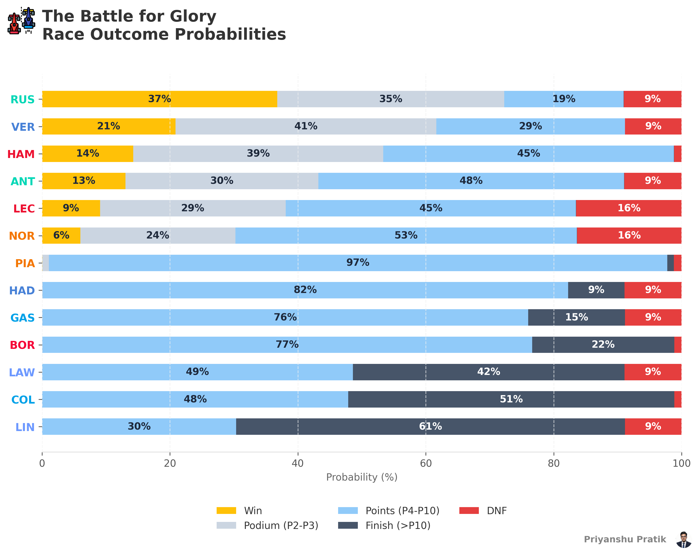
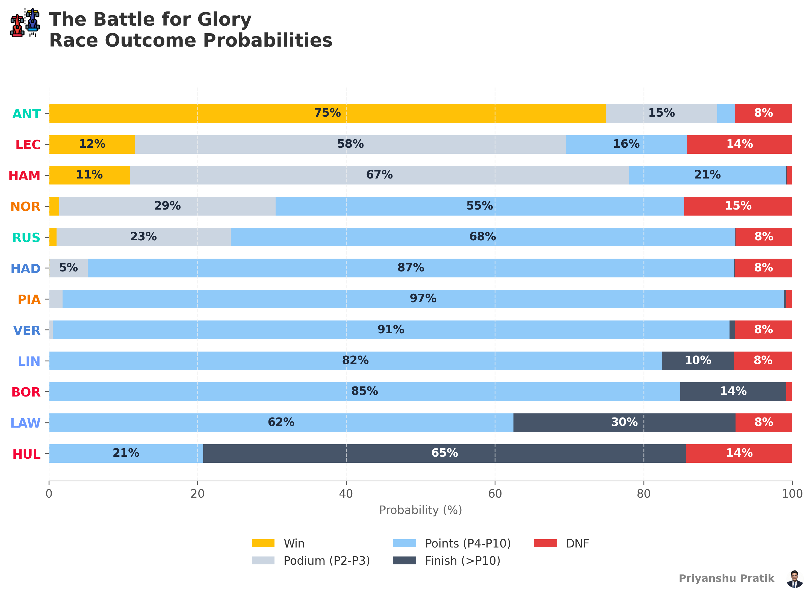
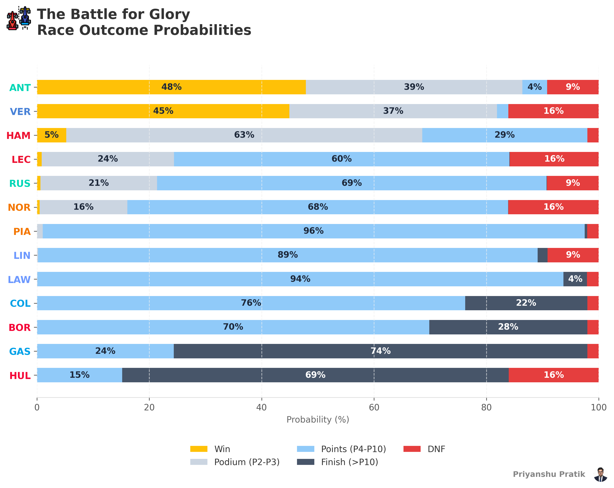
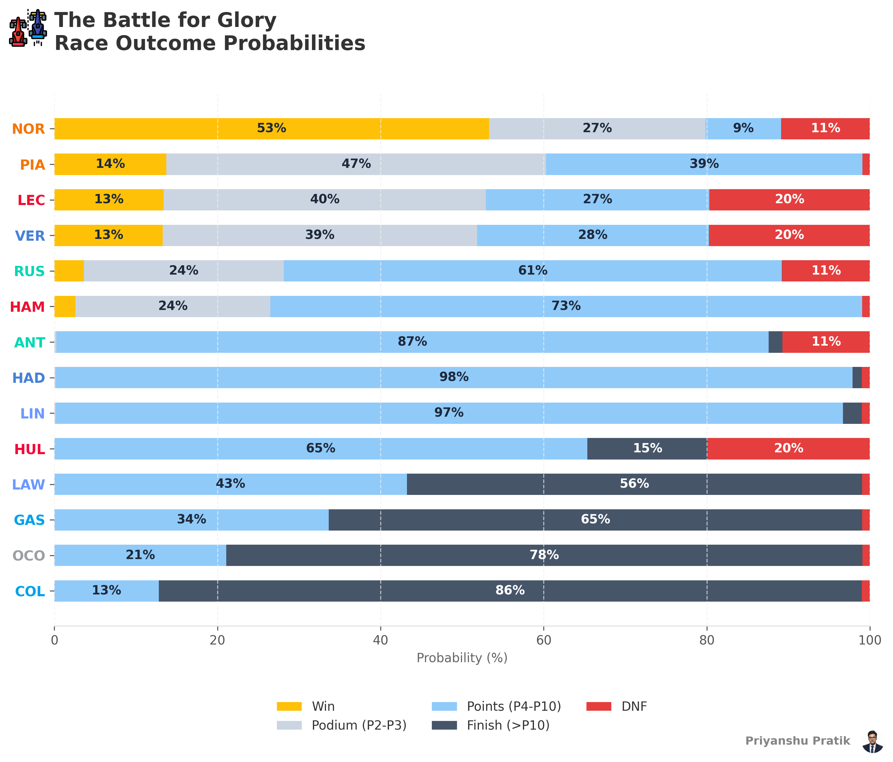
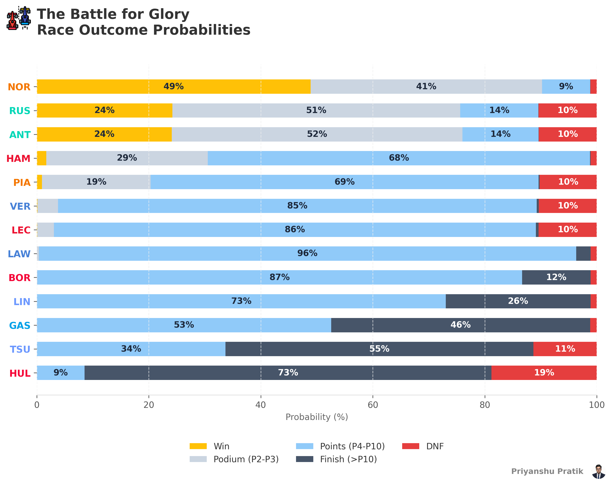

# F1 Monte Carlo Simulation Engine

A highly accurate, data-driven Monte Carlo simulation engine for Formula 1 race prediction. This project leverages historical race data, grid positioning, and driver consistency metrics to simulate tens of thousands of race iterations, generating high-fidelity probabilistic models for race outcomes.

## Table of Contents

1. [2026 Season Pre-Race Win Probability Forecasts](#2026-season-pre-race-win-probability-forecasts)
2. [Architecture](#architecture)
3. [Project Directory Tree](#project-directory-tree)
4. [Prerequisites](#prerequisites)
5. [Local Execution](#local-execution)
6. [Visualization and Outputs](#visualization-and-outputs)
7. [Author & Citations](#author--citations)

---

## 2026 Season Pre-Race Win Probability Forecasts

<details>
<summary><b>🇦🇹 Austrian Grand Prix 2026 (Red Bull Ring)</b> — <i>Generated: June 27, 2026 (Post-Quali)</i></summary>

<br>



</details>

<details>
<summary><b>🇬🇧 British Grand Prix 2026 (Silverstone)</b> — <i>Generated: July 4, 2026 (Post-Quali)</i></summary>

<br>



</details>

<details>
<summary><b>🇧🇪 Belgian Grand Prix 2026 (Spa-Francorchamps)</b> — <i>Generated: July 18, 2026 (Post-Quali)</i></summary>

<br>



</details>

<details>
<summary><b>🇭🇺 Hungarian Grand Prix 2026 (Hungaroring)</b> — <i>Generated: July 25, 2026 (Post-Quali)</i></summary>

<br>



</details>

<details>
<summary><b>🇳🇱 Dutch Grand Prix 2026 (Circuit Zandvoort)</b> — <i>Generated: August 22, 2026 (Post-Quali)</i></summary>

<br>



</details>

---

## Architecture

The simulation engine is separated into modular components designed to handle specific stages of the F1 weekend:

- **Data Pipeline (`data_pipeline.py`)**: Fetches, cleans, and caches historical lap times, sector data, and driver metrics.
- **Qualifying Engine (`quali_engine.py`)**: Simulates the three phases of qualifying (Q1, Q2, Q3) to establish a baseline starting grid, accounting for track evolution and driver one-lap pace.
- **Race Engine (`race_engine.py`)**: Simulates the actual Grand Prix session lap-by-lap using an ultra-fast vectorized NumPy backend. Includes advanced sub-models:
  - *Empirically Bootstrapped DNFs*: Top-down Probability Mass Function (PMF) distribution allocated via the Gumbel-Max trick.
  - *Race Day Setup Variance & Unscheduled Pitstops*: Stochastic modeling for missed setup windows and non-terminal mechanical issues (e.g., slow punctures).
  - *Organic Pacing Variance*: Dynamic ±0.4s lap-time variance and Leader Pacing penalties to induce organic overtaking.
  - *Midfield Grid Density Risk*: Heightened Lap 1 collision weighting for cars starting in the midfield "bottleneck" zone.
  - *Dirty-Air & Superclipping*: Real-time DRS tow factors and 2026-regulation battery drain simulations based on trailing gaps.
- **Backtester (`backtester.py`)**: The primary orchestrator. It triggers the Monte Carlo loop (default 50,000 iterations), aggregates positional frequencies, and outputs probabilistic JSON files.
- **Visualizer (`visualizer.py`)**: Consumes the raw JSON probability distributions and generates professional, high-resolution Matplotlib charts optimized for analytical reporting.

---

## Project Directory Tree

```text
F1 race predictor/
├── .gitignore
├── README.md
├── backtester.py
├── data_pipeline.py
├── quali_engine.py
├── race_engine.py
├── visualizer.py
├── racing-car.png
├── _cache/                     # Local cache for processed data
├── fastf1_cache/               # Local cache for FastF1 API responses
├── visualizations/             # Generated output charts and plots
│   └── f1_sim_*.png
└── *.json                      # Aggregated simulation results (raw_ranks & results)
```

---

## Prerequisites

Ensure that you have Python 3.10 or higher installed on your machine. The system relies heavily on the `FastF1` library along with standard data science packages. 

Install the required dependencies via the terminal:

```bash
python -m pip install pandas numpy fastf1 matplotlib seaborn
```

---

## Local Execution

### 1. Running the Simulation
To generate the simulation data, execute the `backtester.py` script. You can specify the target year, the specific race location, and the volume of Monte Carlo iterations. 

```bash
# Default Execution (Monza 2025, 50,000 iterations)
python backtester.py

# Custom Execution (Austria 2026, 100,000 iterations)
python backtester.py --year 2026 --race austria --iterations 100000
```
*Note: The first execution for a specific race weekend will take significantly longer as the `data_pipeline.py` script downloads and caches the required telemetry from the FastF1 API.*

### 2. Generating the Visualizations
Once the `backtester.py` script successfully generates the output JSON files, you can process them into high-fidelity charts using the `visualizer.py` script.

```bash
# Must match the exact year and race run in the backtester
python visualizer.py --year 2026 --race austria
```

---

## Visualization and Outputs

The `visualizer.py` engine generates five distinct analytical charts located in the `visualizations/` directory:

1. **Win Probabilities**: A 100% stacked horizontal bar chart detailing the exact probability distribution for Win, Podium (P2-P3), Points (P4-P10), Finish (>P10), and DNF per driver.
2. **Tiered Finishes**: Joyplots highlighting density distribution of finishing positions stratified into Front-Runners, Midfield, and Backmarkers.
3. **Expected Points Yield**: Bar chart projecting the mean points haul for the top 10 scoring drivers.
4. **Net Position Change**: Diverging bar chart measuring expected position gains/losses relative to the starting grid.
5. **DNF Risk Profile**: A lollipop chart evaluating historical retirement probabilities against the grid average.

---

## Author & Citations

**Creator & Lead Developer**: Priyanshu Pratik

This analytical engine relies on the foundational work of the open-source community. Please acknowledge the following projects if you adapt or fork this repository:

- **FastF1**: The core telemetry and timing data API. 
  *O. Seibel et al., "FastF1," GitHub repository, 2024.* [FastF1 Documentation](https://docs.fastf1.dev/)
- **Matplotlib**: Foundational architecture for the visualization pipeline.
  *J. D. Hunter, "Matplotlib: A 2D Graphics Environment", Computing in Science & Engineering, vol. 9, no. 3, pp. 90-95, 2007.*
- **Seaborn**: Used for Kernel Density Estimate (KDE) joyplot mappings.
  *M. Waskom, "seaborn: statistical data visualization", Journal of Open Source Software, vol. 6, no. 60, p. 3021, 2021.*
- **NumPy & Pandas**: Essential backend data manipulation and vectorization.
  *C. R. Harris et al., "Array programming with NumPy," Nature, vol. 585, pp. 357–362, 2020.*
  *The pandas development team, "pandas-dev/pandas: Pandas," Zenodo, 2020.*
